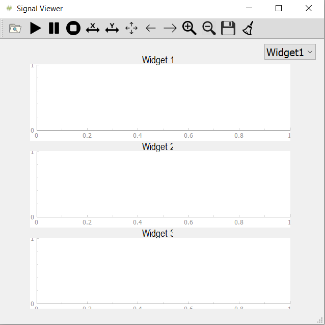
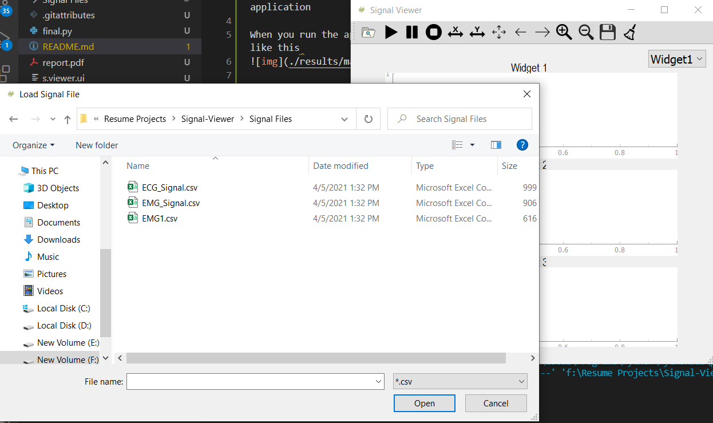
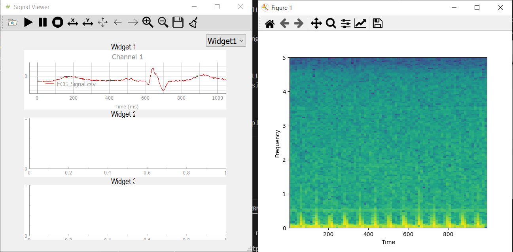
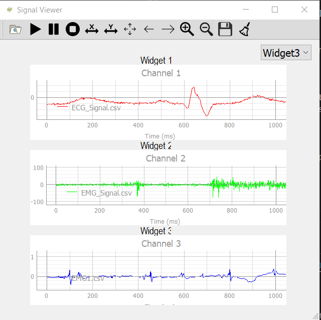
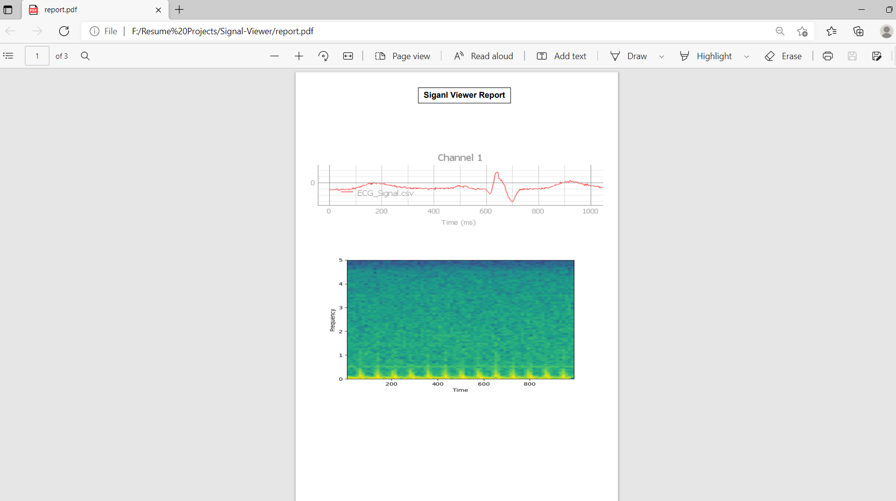
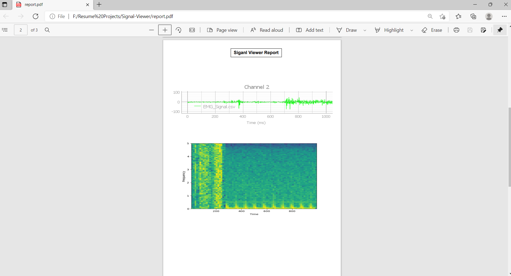
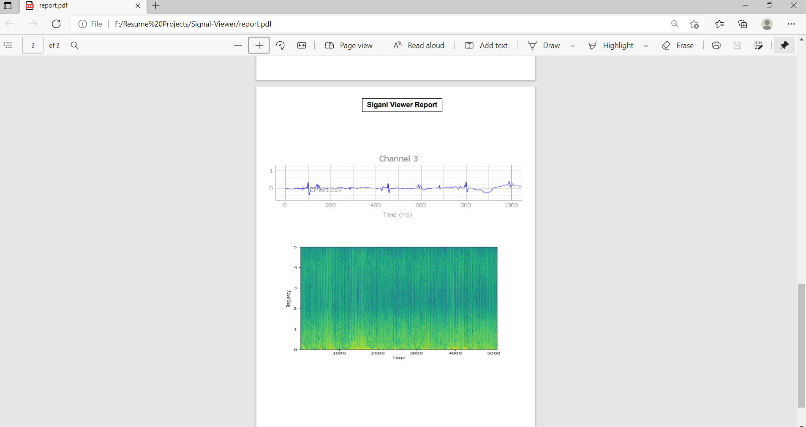
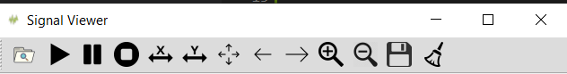

# Signal-Viewer
A Desktop Software that visualizes bio-signals where you can scroll, play, pause, speed up, speed down, zoom in and zoom out the signal, as it views also its spectrogram.

Our main target is to create multi-channel signal viewer application

When you run the app you're going to find the main window like this 

When you click on the search button it will give you the access to navigate and get the signal file you want to plot.

After you choose the signal to plot it will be plotted and it's histogram also will appear

And after we plotted the 3 signals the output was

After you plot the 3 signals when you click on the save button, it shall save the output results in a pdf file called "report"

Finally we applied multiple features on our signals like you can play, pause, shift right, shift left, zoom in, zoom out, and clearing. You just press any operation you want and you will find the result.

